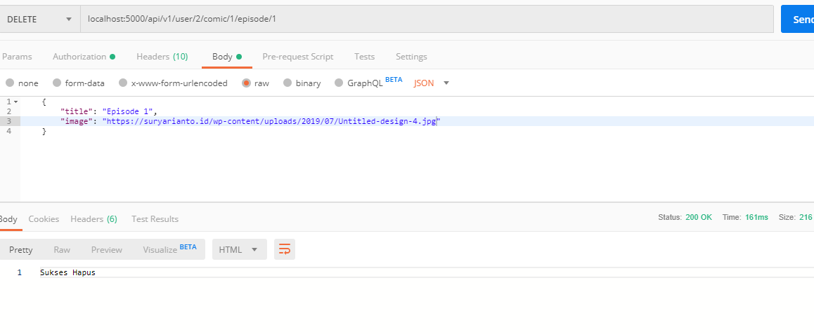

- **Delete Episode**

## Tambah route delete data episode
```javascript
    router.delete('/user/:userId/comic/:comicId/episode/:episodeId', authenticated, EpisodeController.deleteEpisode)
```

## Buat fungsi untuk hapus episode di controller episode
```javascript
    exports.deleteEpisode = (req, res) => {
        Episode.destroy(
        {
            where:{id:req.params.episodeId}
        }).then(comics=>res.send('Sukses Hapus'))
    }
```

## Test Update creation Implementation
