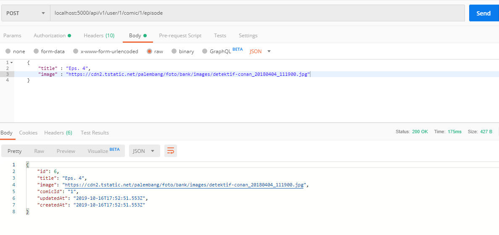
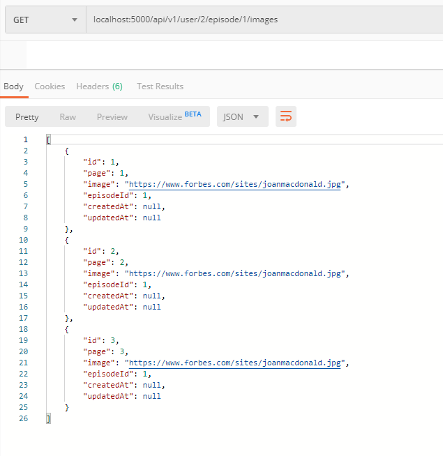

- **Create My Episode**

## Tambah route untuk menambahkan episode dan mengambil data gambar episode yang dibuat
```javascript
    router.post('/user/:userId/comic/:comicId/episode', authenticated, EpisodeController.createEpisode)
    router.get('/user/:userId/episode/:episodeId/images', authenticated, PageController.show)
```

## Buat fungsi untuk menyimpan data episode di controller episode
```javascript
    exports.createEpisode = (req,res) => {
        Episode.create({title: req.body.title, image: req.body.image, comicId: req.params.comicId}).then(episodes=> res.send(episodes))
    }
```

## Buat fungsi untuk mengambil data gambar episode yang dibuat
```javascript
    exports.show = (req, res) => {
        Page.findAll({where:{episodeId: req.params.episodeId}}).then(pages=> res.send(pages))
    }
```

## Test Update creation Implementation
<br />
