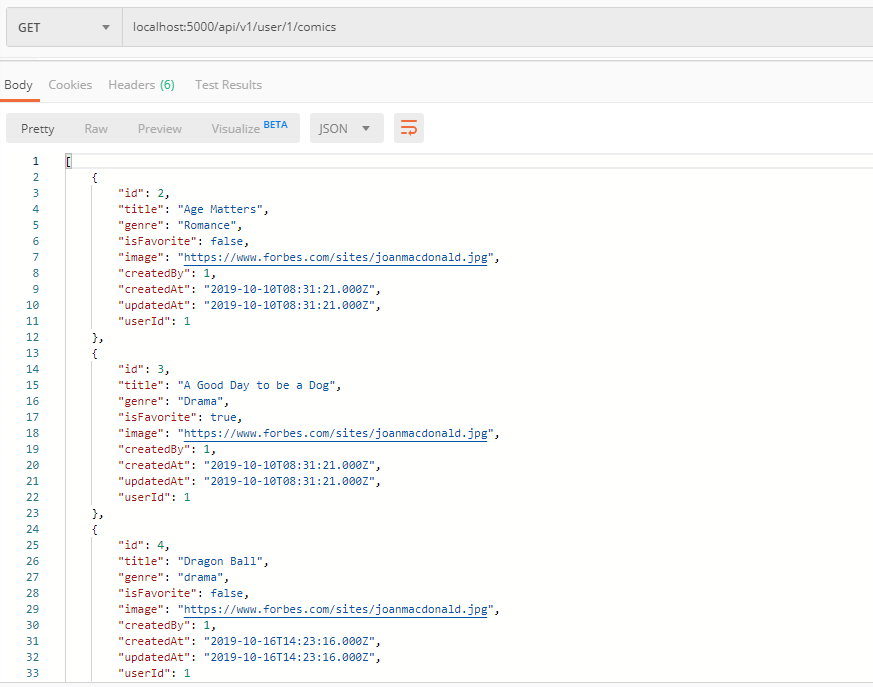
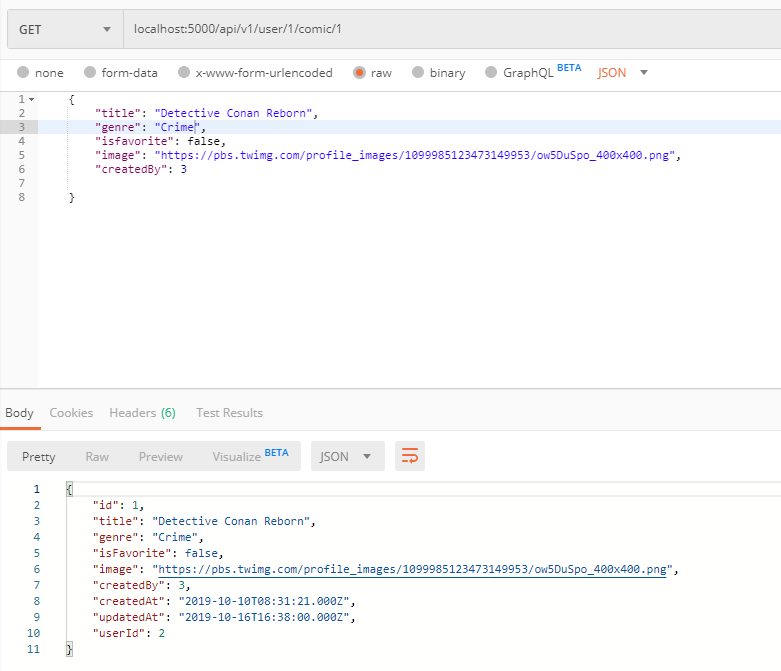
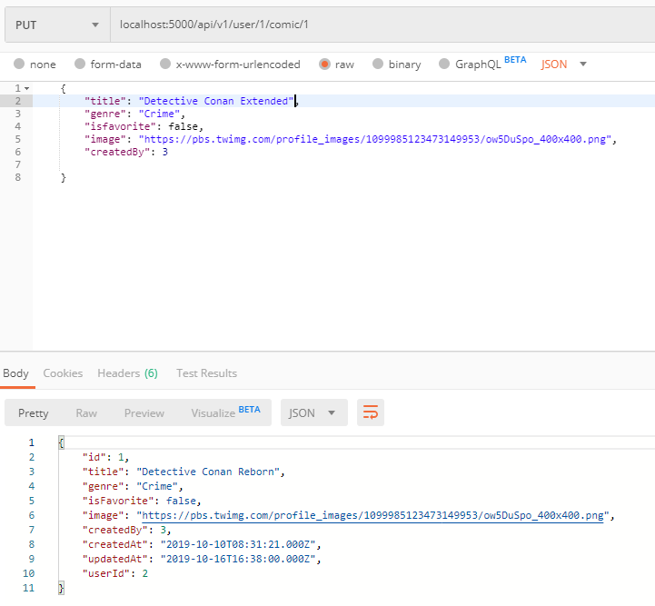
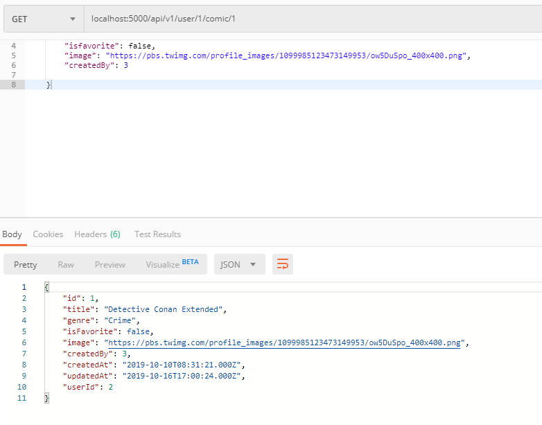

- **Update Comic Creation Implementation**

## Tambah route pada file index.js untuk menampilkan comic berdasarkan id user serta untuk mengubah data
```javascript
    router.get('/user/:userId/comic/:comicId', authenticated, ComicController.show)
    router.put('/user/:userId/comic/:comicId', authenticated, ComicController.updateComic)
```

## Buat fungsi untuk mengubah data berdasarkan id user
```javascript
    exports.updateComic = (req, res) => {
        Comic.update(
        req.body,
        {
            where:{id:req.params.comicId}
        }).then(comics=>res.send(comics))
    }
```

## Test Update creation Implementation
<br />
<br />
<br />
