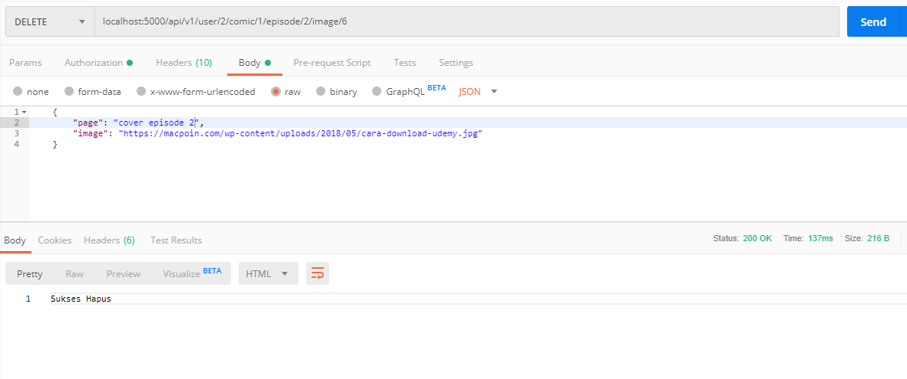

- **Detele Image Detail Episode**

## Tambah route delete data detail episode
```javascript
    router.delete('/user/:userId/comic/:comicId/episode/:episodeId/image/:imageId', authenticated, PageController.deleteImageEpisode)
```

## Buat fungsi untuk menghapus datanya
```javascript
    exports.deleteImageEpisode = (req, res) => {
    Page.destroy(
        {
            where:{id:req.params.imageId}
        }).then(comics=>res.send('Sukses Hapus'))
    }
```

## Test Image Episode Implementation
