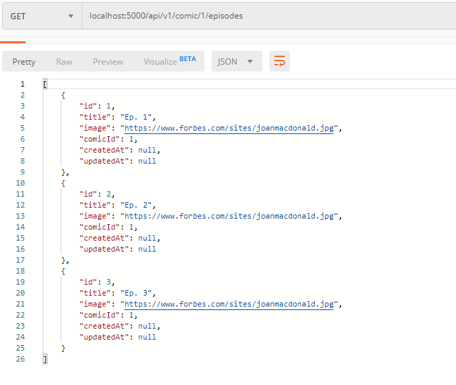

- **Detail Webtoon**

## Buat file migration create-episode

## Buat file seeder untuk mengisi tabel episodes
```javascript
    return queryInterface.bulkInsert('episodes', [
        {
            "title": "Ep. 1",
            "image": "https://www.forbes.com/sites/joanmacdonald.jpg",
            "comicId": 1
            },
            {
            "title": "Ep. 2",
            "image": "https://www.forbes.com/sites/joanmacdonald.jpg",
            "comicId": 1
            },
            {
            "title": "Ep. 3",
            "image": "https://www.forbes.com/sites/joanmacdonald.jpg",
            "comicId": 1
            }
    ])
```

## Membuat relasi pada tabel comics dan tabel episodes
```javascript
    //di model comics
    comic.associate = function(models) {
        comic.hasMany(models.episode,{
        foreignKey:'comicId',
        })
    };

    //di model episode
    episode.associate = function(models) {
        episode.belongsTo(models.comic,{
        foreignKey:'comicId',
        })
    };
```

## Membuat file model episode.js dan membuat fungsi untuk menampilkan data episode berdasarkan comicId
```javascript
//show all episode based on comicId
    exports.indexEpisode = (req, res) => {
        comicId = req.params.comicId
        Episode.findAll({where: {comicId: comicId}}).then(episodes=>res.send(episodes))
    }
```

## Membuat function di comic.js untuk meampilkan data per id
```javascript
    //show data based on id
    exports.show = (req, res) => {
        Comic.findOne({id: req.params.id}).then(comics=> res.send(comics))
    }
```

## Buat route untuk comic di file index.js
```javascript
    const ComicController = require('./controllers/comic')

    router.get('/comics', ComicController.index)
```

## Test detail webtoon implementation


## Buat route untuk menampilkan cimoc berdasarkan id dan menampilkan isi data episode berdasarkan comicId
```javascript
    //get comic based on id comic
    router.get('/comic/:id', ComicController.show)

    //get episodes from comic based on comicId
    router.get('/comic/:comicId/episodes', EpisodeController.indexEpisode)

    //Episode
    router.get('/episodes',EpisodeController.index)
```

## Test For You Implementation
