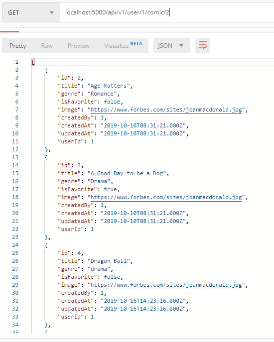
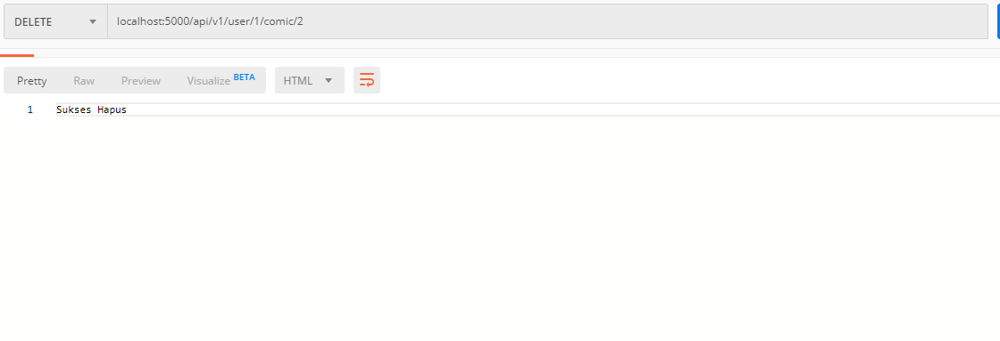

- **Delete Comic Creation Implementation**

## Tambah route pada file index.js untuk menhapus data
```javascript
    router.delete('/user/:userId/comic/:comicId', authenticated, ComicController.deleteComic)
```

## Buat fungsi untuk menghapus data
```javascript
    exports.deleteComic = (req, res) => {
    Comic.destroy(
    {
        where:{id:req.params.comicId}
        }).then(comics=>res.send('Sukses Hapus'))
    }
```

## Test Update creation Implementation
<br />
