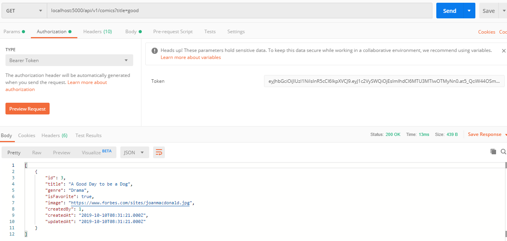

- **Search Webtoon Implementation**

## import module Sequelize.Op dari Sequelize
```javascript
    const Sequelize = require  ('sequelize')
    const Search = Sequelize.Op
```

## Tambahkan perkondisian untuk menerima query pencarian di controller comic pada fungsi index
```javascript
    else if(title) {
      Comic.findAll(
        {
          where: {
            title: {[Search.like] : `%${title}%`}
          }
        }
      ).then(comics => res.send(comics))
    }
```


## Test Detail Episode Implementation
