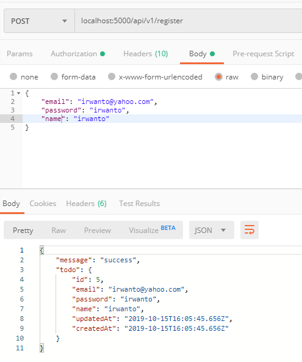
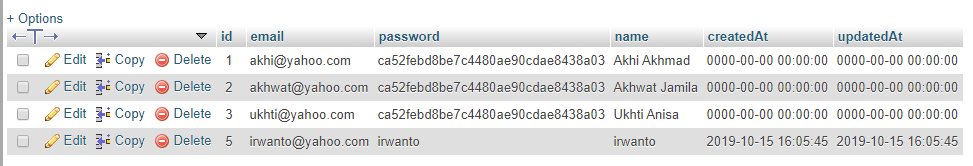

## A. Requirements
- **Membuat Register**

## Menambahkan file controller register.js
```javascript
const models = require('../models')
const Todo = models.todo
const User = models.user

exports.store = (req, res) => {
    User.create(req.body).then(todo=> {
        res.send({
            message: "success",
            todo
        })
    })
}
```

## Menambahkan route register di index.js
```javascript
router.post('/register', RegisterController.store)
```

## Test Login

<br />
