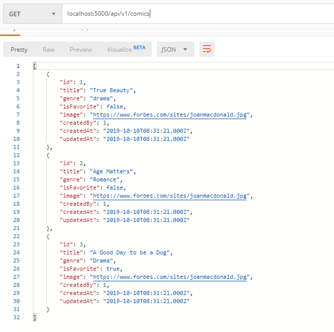

## A. Requirements
- **For You Implementation**

## Mengatur konfigurasi database di file config.json
```javascript
    "development": {
    "username": "root",
    "password": null,
    "database": "webtoonclone",
    "host": "127.0.0.1",
    "dialect": "mysql"
```

## Membuat file migration create_comic

## Buat Model comic
```javascript
    'use strict';
    module.exports = (sequelize, DataTypes) => {
    const comic = sequelize.define('comic', {
        title: DataTypes.STRING,
        genre: DataTypes.STRING,
        isFavorite: DataTypes.BOOLEAN,
        image: DataTypes.STRING,
        createdBy: DataTypes.INTEGER
    }, {});
    comic.associate = function(models) {
        // associations can be defined here
    };
    return comic;
    };
```

## Membuat file seeder comic dan diisi dengan data dummy

## Buat route untuk comic di file index.js
```javascript
    const ComicController = require('./controllers/comic')

    router.get('/comics', ComicController.index)
```

## Test For You Implementation

