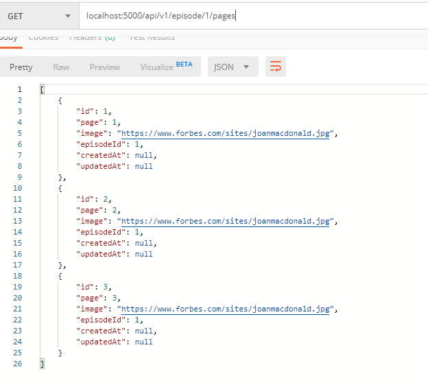

- **Detail Episode Implementation**

## Buat file migration create-page

## Buat file seeder untuk mengisi tabel pages
```javascript
    return queryInterface.bulkInsert('pages', [
        {
            "page": 1,
            "image": "https://www.forbes.com/sites/joanmacdonald.jpg",
            "episodeId": 1
        },
        {
            "page": 2,
            "image": "https://www.forbes.com/sites/joanmacdonald.jpg",
            "episodeId": 1
        },
        {
            "page": 3,
            "image": "https://www.forbes.com/sites/joanmacdonald.jpg",
            "episodeId": 1
        }
    ])
```

## Membuat relasi pada tabel episodes dan tabel pages
```javascript
    //di model episode
    episode.associate = function(models) {
        // associations can be defined here
        episode.belongsTo(models.comic,{
        foreignKey:'comicId',
        })
        episode.hasMany(models.page,{
        foreignKey:'episodeId',
        })
    };

    //di model page
    page.associate = function(models) {
        // associations can be defined here
        page.belongsTo(models.episode,{
        foreignKey:'episodeId',
        })
    };
```

## Membuat file model page.js dan membuat fungsi untuk menampilkan data page berdasarkan episodeId
```javascript
    //show all page based on episodeId
    exports.indexPage = (req, res) => {
        episodeId = req.params.episodeId
        Page.findAll({where: {episodeId: episodeId}}).then(pages=>res.send(pages))
    }
```

## Membuat function di episode.js untuk meampilkan data per id
```javascript
    //show data based on id
    exports.show = (req, res) => {
        Episode.findOne({id: req.params.id}).then(episodes=> res.send(episodes))
    }
```

## Buat route untuk menampilkan episode berdasarkan id dan menampilkan isi data page berdasarkan episodeId
```javascript
    //get episode based on id comic
    router.get('/episode/:id', EpisodeController.show)

    //get pages from episode based on episodeId
    router.get('/episode/:episodeId/pages', PageController.indexPage)

    //Page
    router.get('/pages',PageController.index)
```

## Test For You Implementation
