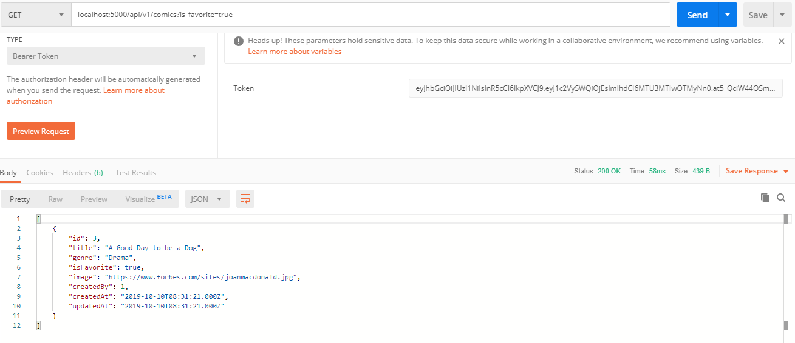
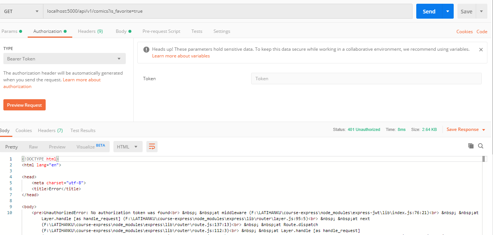

- **Fovorite Implementation dengan authentication**

## Install express-jwt dan jsonwebtoken

## Buat file migration create-user

## Buat file seeder untuk mengisi tabel pages
```javascript
    return queryInterface.bulkInsert('users', [
      {
        email: 'irwanto@yahoo.com',
        password: 'irwanto',
        name: 'Irwanto'
      },
      {
        email: 'wibowo@yahoo.com',
        password: 'wibowo',
        name: 'Wibowo'
      },
      {
        email: 'rina@gmail.com',
        password: 'rina',
        name: 'Rina'
      },

    ])
```

## Buat file Middleware
```javascript
    const jwt = require('express-jwt')

    exports.authenticated = jwt({secret: 'my-secret-key'})
```

## buat file controller auth.js
```javascript
   const jwt = require('jsonwebtoken')

const models = require('../models')
const User = models.user

exports.login = (req, res)=>{
    //check if email and pass match in db tbl user
    const email = req.body.email
    const password = req.body.password //use encryption in real world case!

    User.findOne({where: {email, password}}).then(user=>{
        if(user){
            const token = jwt.sign({ userId: user.id }, 'my-secret-key')
            res.send({
                user,
                token
            })
        }else{
            res.send({
                error: true,
                message: "Wrong Email or Password!"
            })
        }
    })
    }
```

## Import fungsi authenticated di index js
```javascript
    const {authenticated} = require('./middleware')
```

## Apply fungsi authenticated di route comics
```javascript
    router.get('/todos', authenticated, TodosController.index)
```

## Modifikasi method/fungsi index  supaya bisa menampilkan data my favorite
```javascript
exports.index = (req, res) => {
    //Buat variabel query untuk menampung
    const {is_favorite} = req.query
    console.log(is_favorite)

    if(is_favorite=='true'){
        Comic.findAll({
            where:{
            isFavorite:true
            }
        }).then(comics => res.send(comics))
        } else if(is_favorite=='false'){
        Comic.findAll({
            where:{
            isFavorite:false
            }
        }).then(comics => res.send(comics))
        } else {
        Comic.findAll().then(comics => res.send(comics))
        }
    }
```

## Test Detail Episode Implementation
<br />
