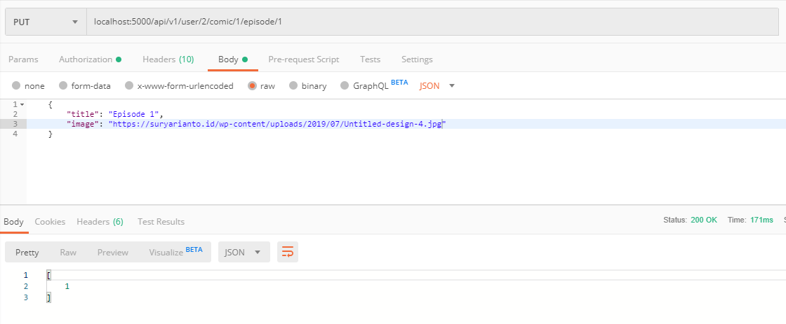

- **Update Episode**

## Tambah route ubah data
```javascript
    router.put('/user/:userId/comic/:comicId/episode/:episodeId', authenticated, EpisodeController.updateEpisode)
```

## Buat fungsi untuk mengubah data episode di controller episode
```javascript
    exports.updateEpisode = (req, res) => {
        Episode.update(
        req.body,
        {
            where:{id:req.params.episodeId}
        }).then(comics=>res.send(comics))
    }
```

## Test Update creation Implementation
