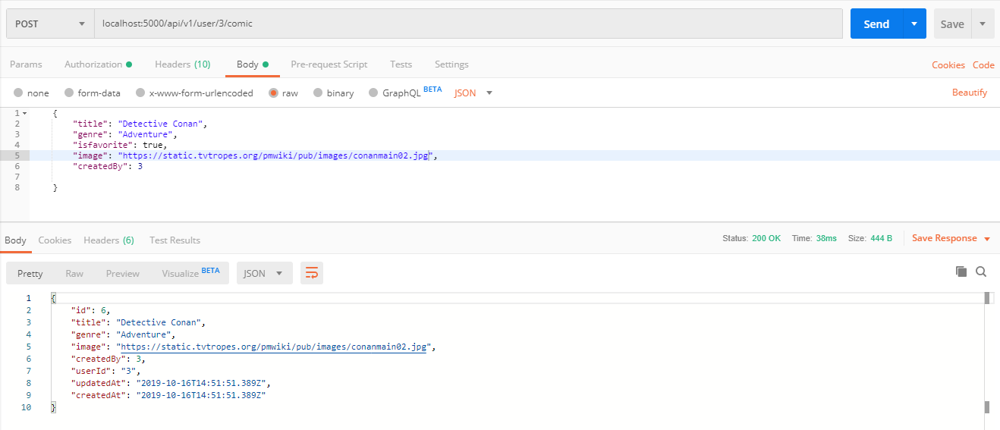

- **Create Webtoon Creation Implementation**

## Tambah route pada file index.js
```javascript
    router.get('/user/:userId/comics', authenticated, ComicController.userComic)
    router.post('/user/:userId/comic', authenticated, ComicController.createComic)
```

## Buat fungsi untuk memasukkan data berdasarkan id user
```javascript
    //create comic based user
    exports.createComic = (req, res) => {
    Comic.create(req.body, req.body.userId = req.params.userId).then(comics=>res.send(comics))
}
```

## Test webtoon creation Implementation
