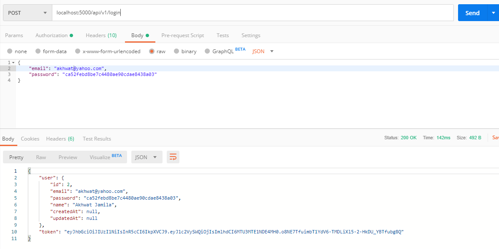

## A. Requirements
- **Membuat Login**

## Menambahkan route di index
```javascript
router.post('/login', AuthController.login)
```


## Menambahkan controller auth.js

```javascript
const jwt = require('jsonwebtoken')

const models = require('../models')
const User = models.user

exports.login = (req, res)=>{
    //check if email and pass match in db tbl user
    const email = req.body.email
    const password = req.body.password //use encryption in real world case!

    User.findOne({where: {email, password}}).then(user=>{
        if(user){
            const token = jwt.sign({ userId: user.id }, 'my-secret-key')
            res.send({
                user,
                token
            })
        }else{
            res.send({
                error: true,
                message: "Wrong Email or Password!"
            })
        }
    })


}   
```
## Menambahakan middleware.js

```javascript
const jwt = require('express-jwt')

exports.authenticated = jwt({secret: 'my-secret-key'})
```

## Test Login

