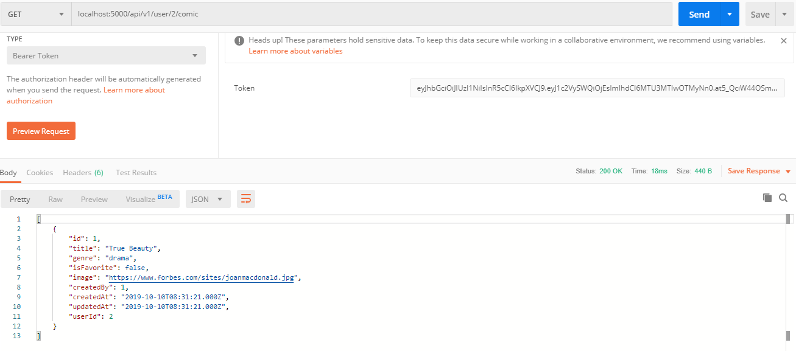

- **Webtoon Creation Implementation**

## Tambah route pada file index.js
```javascript
    router.get('/users',UserController.index)
    router.get('/user/:id',UserController.show)
    router.get('/user/:userId/comic', ComicController.userComic)
```

## Tambah fungsi untuk menampilkan semua user dan user berdasarkan id di controller user
```javascript
    exports.index = (req, res) => {
        User.findAll().then(users=>res.send(users))
    }

    //show episode item based on episode id
    exports.show = (req, res) => {
        User.findOne({id: req.params.id}).then(users=> res.send(users))
    }
```

## Di controller comic tambah fungsi untuk menampilkan data comic berdasarkan id user
```javascript
    //show all episode based on comicId
    exports.userComic = (req, res) => {
        userId = req.params.userId
        Comic.findAll({where: {userId: userId}}).then(comics=>res.send(comics))
    }
```


## Test webtoon creation Implementation
<br />
